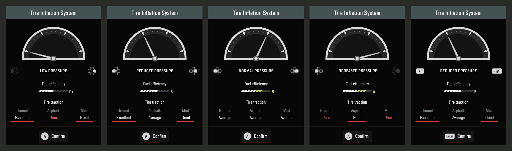

# SnowRunner Tire Inflation System

Tire pressure you change while driving, as in Expeditions: A MudRunner Game.

The truck you drive gets four pressure modes: Low, Reduced, Normal and Increased. Let air out and the tires flatten, grip harder on dirt, sand, rock and in mud, and lose grip on asphalt. The truck also uses more fuel and steers slower. Increased is the road mode: more grip on asphalt, less everywhere else, less fuel. Soft tires driven too fast take damage until they go flat. You pick the mode on Expeditions' panel, drawn in SnowRunner's font, with the pad or a key. You hear the air go out and in, and every few fillings the compressor.



## What you need

- SnowRunner for Windows. The mod was made on the Steam version (the game build of 22 July 2026). At every start it looks for the places it needs in the game's code. Where it does not find every one of them, on another build of the game, it writes that into its log and does nothing. The Epic Games Store version has not been tested.
- For the panel and the settings tab: ReShade 6.8.0 or newer, the build "with full add-on support". The zip brings it along. Without ReShade the key still changes the pressure, with beeps in place of the panel.

## Install

1. Close the game.
2. Copy `version.dll` and `TirePressure.asi` into the game's `Sources\Bin` folder, next to `SnowRunner.exe`.
3. No ReShade in the game yet? Copy `dxgi.dll` and `ReShade.ini` from the zip's `ReShade` folder there too.
4. Start the game. The Home key opens ReShade's overlay.

The `ReShade` folder holds ReShade 6.8.0 with full add-on support as reshade.me offers it, unchanged, and a `ReShade.ini` that only skips its first-start tutorial. If ReShade is already in the game, or another mod's `dxgi.dll`, leave those as they are: any ReShade from 6.8.0 on with add-on support will do. `TirePressure.asi` finds ReShade when the game starts.

`version.dll` is a small loader: it loads every file in that folder whose name ends in `.asi`. If you already use an ASI loader (other `.asi` mods work in that folder), copy only `TirePressure.asi` and leave your loader as it is. If another mod's `version.dll` is there and it is not an ASI loader, rename that one to `version_chain.dll` first, and this loader passes everything on to it.

To update, copy the two new files over the old ones. Keep only one `.asi` file of this mod in the folder: a second copy under another name stands down and says so in the log.

## Use

With a pad (any pad Windows sees as an Xbox pad):

- LB + d-pad down opens the panel.
- LB + d-pad left or right lowers or raises the pressure. With the panel closed, it opens the panel one step lower or higher.
- While the panel is open the d-pad works without LB, A confirms and B closes the panel unchanged.

With the keyboard, F3 opens the panel and steps the pressure down, from Low round to the highest mode.

A choice left alone confirms itself after 15 seconds. The tires then take up to 6 seconds to deflate or inflate: 6 from Normal to Low, less for a smaller step. As the change begins the mod beeps: once for Normal, twice for Reduced, three times for Low, one high beep for Increased.

The mode belongs to the truck you drive: another truck takes the current mode when you get in. Every game start begins at Normal.

## Sounds

- Deflating plays the air being let out. It gets weaker as the tires empty and stops with a puff.
- Filling plays the air going in.
- The compressor does not run at every filling. The air comes out of a tank, and the compressor fills the tank again once it has fallen far enough: at every second filling from Low to Normal, at every fourth of a single step. It then runs for about 17 seconds, also after the filling is done, and lets its own air go as it stops.

The two air sounds are recordings of a real tire, made for this mod. The compressor is made by the mod's own code. The air it lets go as it stops is a sound of SnowRunner itself, which the mod reads out of the game's sound file while the game runs. You hear all of them while you drive a truck and the game's window is in front.

## The modes

Multipliers against the tire's own values:

| | Low | Reduced | Increased |
|---|---|---|---|
| Grip on dirt | x3.5 | x3.0 | x0.9 |
| Grip on gravel | x2.75 | x2.4 | x0.95 |
| Grip on sand | x4.0 | x3.4 | x0.85 |
| Grip on rock | x3.5 | x3.0 | x0.9 |
| Grip on asphalt | x0.85 | x0.95 | x1.3 |
| Grip in mud | x1.3 | x1.15 | x0.85 |
| Tire radius | up to 10 cm less | up to 6 cm less | unchanged |
| Fuel use while moving | x1.5 | x1.25 | x0.85 |
| Steering speed | x0.7 | x0.85 | x1.1 |

Each wheel takes the grip for the ground under it, so a truck with two wheels on a gravel road and two in sand grips differently left and right. Grip stops at 10, as in Expeditions.

The game draws the flattened tires itself, and only so flat. Where 10 cm would put the tread under the ground, both steps shrink by the same share: a scout on 94 cm tires gets 6.7 and 4 cm. A flattened tire rolls a little less far per turn, as a real one does: that scout loses about 5% of its speed at Low and 3% at Reduced.

## Tire damage

Soft tires wear when the truck is too fast for them:

| | Low | Reduced |
|---|---|---|
| Wear starts above | 20 km/h | 35 km/h |
| Most wear from | 30 km/h | 45 km/h |
| Damage per wheel | 4 to 8 | 2 to 6 |
| Every | 7 seconds | 10 seconds |

A SnowRunner wheel takes about 50 damage. While the truck is too fast a warning shows at the top left with the most worn tire's damage in percent, and a low beep marks each hit. A worn out tire goes flat. This is the game's own wheel damage: the game's wheel icon turns red for a flat tire, the damage stays in the save, and it is repaired like any other damage. The numbers start from those of Expeditions' off-road tires, with twice the damage at lower speeds, as SnowRunner's trucks are slower off the road.

## Settings

With ReShade, the overlay has a Tire Inflation System tab. It shows the truck's tires, the ground under the first wheel and the speed, and it edits every setting while you play:

- Every number in the two tables above, and tire damage on or off.
- Whether flattened tires roll like real ones. On by default. Off, the truck loses about three times as much speed.
- Vanilla balance: tires that grip better than every vanilla tire on ground, asphalt and mud at once (some modded trucks have them) come down to the best vanilla tire of their kind. Vanilla tires stay as they are. Off by default.
- Base grip for ground, asphalt and mud: scales every mode, Normal too.
- Asphalt floor: every tire grips at least this much on paved ground. Off by default.
- The key, the pad buttons, the panel's size, the time until a choice confirms itself, how long a pressure change takes, the sound volume (0 turns the sounds off), and the beep.

Changes count at once and are saved to `TirePressure.ini` in the same folder. Without ReShade, edit that file: the game writes it with the defaults and a short guide on its first start.

Four keys are in the ini alone. `AirOutSound`, `AirInSound`, `CompressorSound` and `CompressorStopSound` each put another sound in place of the mod's own: the name of a WAV file in `Sources\Bin`, or of a sample in the game's `shared_sound.pak` such as `[sound]\actors\actor_lamp_generator_loop.pcm`. `none` leaves that sound out. The first three play round and round while they last. A WAV file with a loop marked in it plays up to the loop once, then goes round in the loop, and plays what follows the loop as the sound stops.

## Remove

Delete `TirePressure.asi`, `TirePressure.ini`, `TirePressure.log`, `version.dll` and `AsiLoader.log` from `Sources\Bin`. If you renamed another mod's `version.dll` to `version_chain.dll`, rename it back. If you took ReShade from the zip and want it gone too, delete `dxgi.dll`, `ReShade.ini` and `ReShade.log`.

## Notes

- The mod changes values in the running game's memory. It changes no game file.
- Trailers keep their tires as they are.
- The pad's panel buttons are taken from the game only while you drive a truck. In menus they are the game's.
- Co-op has not been tested.
- Without a sound device the sounds stay off and everything else works.
- After a game update the mod keeps working when the game's code around its places is unchanged. When it is not, the mod does nothing and says so in its log, until a version for the new game is out.
- If something does not work, `TirePressure.log` in `Sources\Bin` says what the mod found and did.

## Build

Windows with Visual Studio 2022 (C++ desktop tools).

```
build.bat
test.bat
```

`build.bat` makes `out\version.dll` and `out\TirePressure.asi`. `test.bat` runs the offline tests: the loader on a test `.asi`, the loader with a copy of itself as its chain file, the loader behind another ASI loader that had the `.asi` first, and the mod's own checks (every setting through the ini and back, the flattening and gear numbers, the readers of the sound files, the compressor's tank). `out\test\probe_test.exe sound` plays the sounds through the default sound device as the mod does in the game. `test\build_preview.bat` builds a program that draws the panel, the warning and the settings tab into PNG files without the game and checks the pad binding window. It needs the Dear ImGui sources, see the file.

A few places the mod needs lie elsewhere in every build of the game's exe. It finds them itself (`src\build_find.h`). `out\test\probe_test.exe find <exe>` runs the same search on an exe in a file and prints what it found and what it did not. Steam's exe on disk will not do for that, as its code is only readable in the running game. With `SR_IMAGE` set to a copy of the exe's image from a running game, `test.bat` checks the search against the numbers of the Steam build.

## How it works

A thread in the game process reads and writes the game's own values 20 times a second, through `ReadProcessMemory` and `WriteProcessMemory` on its own process, so an object the game frees under it gives an error and no crash. No game code is patched. Three of the game's pointers are pointed at the mod: its two pointers to `XInputGetState` and one entry of its import table.

At its start the mod looks through the exe for the places it needs: two of the game's classes by their names, the game's damage update, the truck update's call into Windows and the global that leads to the driven truck. It also checks six spots of game code that use the same positions inside the game's objects as the mod does. Every one has to be there exactly once. If not, the mod stands down and has changed nothing.

- Grip: the asphalt and mud grip of each wheel, and the truck's list of ground grip values, one per wheel. The game marks each wheel every frame with the kind of ground under it (gravel, sand, hard, paved), and the mod picks the factor from that.
- Flattening: the radius of the wheel's collision cylinder, held to what the game's wheel shader can draw flat.
- Speed: in the game the wheel is its collision cylinder, so a flattened tire would lose about three times the speed a real one does, whose belt keeps its length. The mod raises the truck's gear speeds by the difference.
- Fuel and steering: the truck's fuel consumption values and its steering speed.
- Damage: the game's damage data for each wheel. The game's truck update asks Windows once a frame which window is in front. That import table entry leads through the mod, which deals the damage at that moment, on the game's own thread, and then runs the game's damage update. The update makes a worn out tire flat, mends a repaired one and sums the truck's damage.
- Pad: the game keeps two pointers to `XInputGetState`. The mod points both at a filter that hides the panel's buttons from the game while the panel uses them.
- Panel: drawn through ReShade's add-on overlay. The text is baked from the game's own font files at run time.
- Sound: a thread of its own plays through XAudio2, the library the game brings and uses itself, and only holds a sound device while a sound plays. The two recordings are in the `.asi` (`assets`, `src\sounds.rc`): each has its start, a steady part that goes round for as long as the change lasts, and its stop. The compressor is made by code: 47 knocks a second that ring in a housing, with the air it draws and the motor's hum. The air it lets go as it stops comes out of the game's `shared_sound.pak`, a zip in which the samples lie as WAV files. A tank decides when the compressor runs: a filling takes air out of it, and below a mark the compressor runs until it is full.

## Licence and credits

GNU General Public License v3.0 (GPL-3.0-only), see `LICENSE`.

The tire inflation system, its panel and its numbers are from Expeditions: A MudRunner Game by Saber Interactive. The panel is drawn through ReShade by Patrick Mours (crosire) with Dear ImGui by Omar Cornut, and its text is baked with stb_truetype by Sean Barrett. Their notices are in `THIRD_PARTY_NOTICES.md`. The asphalt floor follows an idea by Naybour. The sounds of air let out of a tire and of air going into one (`assets`) were recorded for this mod and are under its licence.

SnowRunner and Expeditions are games by Saber Interactive. This project is not affiliated with Saber Interactive or Focus Entertainment and contains no game files.
